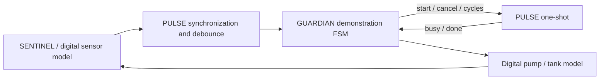

# PULSE: Water Tank Level & Dry-Run Protection Controller

PULSE is a reusable, synthesizable Verilog HDL timer, periodic clock-enable generator, and sensor-qualification block. This university Micro2Nano project demonstrates its use in a digital water-tank controller: reject sensor noise, measure an initial pump-response window, and provide deterministic timing to protection logic.

The software baseline includes RTL, self-checking ModelSim tests, digital application models, waveform evidence, and Quartus analysis/synthesis checks. All seven testbenches pass, including an independent periodic checker self-test. Physical implementation is future work; sensor meanings, clock specifications, and protection policy remain explicitly provisional. See [final report](docs/FINAL_REPORT.md) for evidence and limits.

Implementation language: Verilog HDL (Verilog-2001). All 16 RTL, model, checker, and testbench sources use `.v`. The [conversion report](docs/VERILOG_CONVERSION.md) records the original language migration; the [oscillator completion report](docs/OSCILLATOR_COMPLETION.md) records the current implementation and clean verification.

## What PULSE does

- `pulse_timer`: one runtime-configured interval, exact cycle-count completion, busy status, and cancellation.
- `pulse_debounce`: two-stage input acquisition followed by a full stability interval; initial readings remain invalid until qualified.
- `pulse_periodic`: a captured runtime period, automatic reload, and registered recurring ticks with independent enable.
- `pulse_top`: one timer, one periodic generator, and independently operating sensor channels.
- `water_tank_controller`: a replaceable GUARDIAN demonstration adapter that starts filling at LOW, continues through MID, stops at FULL, and latches suspected dry-run if the expected initial response is absent.

The timer does not diagnose a physical fault by itself. The demonstration controller interprets its elapsed event. Periodic generation implements the documented working tick contract. It uses the input clock and produces a clock enable; it does not generate a square-wave clock. The water-tank adapter disables this function, while a synchronous consumer in the unit bench demonstrates its use.



## Run the tests on Windows

From the repository root, with ModelSim `vsim` on PATH:

```powershell
.\sim\run.ps1
```

The runner creates a fresh directory under `build/modelsim`, compiles all RTL/models/testbenches with `vlog -vlog01compat`, and runs seven isolated simulations. Expected output contains:

```text
PASS pulse_timer_tb
PASS pulse_debounce_tb
PASS pulse_periodic_smoke_tb
PASS pulse_periodic_checker_tb
PASS pulse_periodic_tb
PASS pulse_top_tb
PASS water_tank_system_tb
Artifacts: ...
```

Each run saves compile/test transcripts, named WLF waveform files, application/periodic/top VCD files, and `results.json`. A test must reach its explicit success flag, produce the runner marker, and have no error diagnostic. A watchdog and process timeout prevent hanging tests. To select one test or supply an installation location:

```powershell
.\sim\run.ps1 -Test water_tank_system_tb
.\sim\run.ps1 -ModelSimBin 'C:\path\to\modelsim\bin'
```

Run analysis and synthesis, without fitting or programming hardware:

```powershell
.\synth\run.ps1
```

The synthesis runner discovers Quartus from PATH, `QUARTUS_ROOTDIR`, or `-QuartusBin`. It checks both `pulse_top` and `water_tank_controller` against a representative Cyclone IV E device. This is not a board selection or timing-closure claim. Full setup, manual commands, and waveform viewing are in the [simulation guide](docs/SIMULATION_GUIDE.md).

## Timing and application assumptions

The illustrative input clock is 50 MHz (20 ns). The default debounce is 1,000,000 cycles (20 ms), with acquisition/consumer latency in addition. A 32-bit timer accepts 0…4,294,967,295; zero means one clock cycle. Maximum positive duration at that clock is 85.8993459 s. Runtime configuration is captured at start; cancellation suppresses expiry, and starts while busy are ignored.

The demonstration uses `{full, above_low}` threshold bits, a unitless 0…100 tank model, and an example 5 s protection configuration. Application tests accelerate counts; the debounce unit test separately executes the full default interval. The full 5 s and maximum 32-bit timer expirations have not been simulated: their capture/decrement/cancellation are checked, while every duration of an 8-bit timer is exercised to completion.

Periodic configuration is captured on the first edge with both enables HIGH. The first tick appears P full clock intervals later and repeats every P intervals. Zero maps to one; P = 1 stays HIGH after startup to enable every cycle. Live configuration changes are ignored until disable/re-enable. See the [edge-level contract](docs/OSCILLATOR_CONTRACT.md) and [demonstration guide](docs/OSCILLATOR_DEMO.md).

## Repository structure

```text
.vscode/             Workspace Verilog file association
pulse.teroshdl.yml    Portable Verilog/ModelSim TerosHDL project
src/                 Synthesizable PULSE RTL
src/application/     Provisional GUARDIAN demonstration controller
tb/                  Seven self-checking testbenches plus periodic checker
tb/models/           Simulation-only pump, tank, and sensor/noise models
sim/                 Portable ModelSim compile/run/wave scripts
synth/               Quartus analysis/synthesis script and example clock constraint
docs/                Requirements, contracts, design, verification, and reports
docs/waveforms/       Small review artifacts derived from recorded simulation
build/               Ignored local simulation/synthesis artifacts
```

Tested tools: ModelSim-Altera Starter 10.1d and Quartus II 13.0.1 SP1 on Windows. No alternate simulator is required. The portable `pulse.teroshdl.yml` project selects ModelSim and classifies every HDL source as Verilog. It is also registered locally as `PULSE_Verilog`; reload the VS Code window if the open extension still shows its previous selection. See the [simulation guide](docs/SIMULATION_GUIDE.md) for import and compiler settings.

## Engineering documents

- [Completed oscillator tasks](docs/PULSE_OSCILLATOR_TEAM_TASKS.md), [completion evidence](docs/OSCILLATOR_COMPLETION.md), [contract](docs/OSCILLATOR_CONTRACT.md), [demonstration](docs/OSCILLATOR_DEMO.md).
- [Inventory](docs/project_inventory.md), [requirements](docs/PULSE_REQUIREMENTS.md), [timing](docs/PULSE_TIMING_SPEC.md), [interface](docs/PULSE_INTERFACE.md).
- [Architecture](docs/PULSE_ARCHITECTURE.md), [state machines](docs/PULSE_STATE_MACHINES.md), [application behavior](docs/WATER_TANK_BEHAVIOR.md), [integration contract](docs/INTEGRATION_CONTRACT.md).
- [Verification plan](docs/PULSE_VERIFICATION_PLAN.md), [traceability](docs/TRACEABILITY_MATRIX.md), [waveform observations](docs/WAVEFORM_OBSERVATIONS.md), [synthesis check](docs/SYNTHESIS_CHECK.md).
- [Historical Verilog conversion and project structure](docs/VERILOG_CONVERSION.md).
- [Final report](docs/FINAL_REPORT.md), [known issues and limitations](docs/KNOWN_ISSUES.md), [future hardware path](docs/FUTURE_HARDWARE_IMPLEMENTATION.md).
