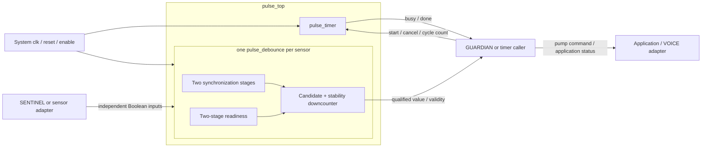

# PULSE architecture

Status: working software/RTL baseline following the user's instruction to continue on 2026-09-10. External team interfaces and physical timing values remain **PROVISIONAL — pending agreement with integration team**.

## 1. Decisions and scope

This architecture applies the classified requirements and A-01 through A-12 in [requirements](PULSE_REQUIREMENTS.md). The user's continuation permits work beyond the original four-document review stop. Internal design review precedes RTL; it does not constitute SENTINEL/GUARDIAN/VOICE approval.

Use one system-clock domain with independent timing state for the one-shot and each sensor. Direct cycle counts preserve exact start-to-expiry timing. Keep pump/fault policy outside the reusable block. The numerical baseline remains an illustrative 50 MHz clock, 1,000,000-cycle debounce, and a runtime 250,000,000-cycle application window.

| Decision | Selected approach | Alternative / reason |
| --- | --- | --- |
| Module decomposition | `pulse_timer`, `pulse_debounce`, `pulse_top` | A separate general counter adds wiring/control ownership without another consumer. Each function owns its small downcounter. |
| Timer datapath | Unsigned remaining-cycle count, loaded at accepted start | An upcounter plus captured target needs another wide stored value. A remaining count itself captures the requested interval. |
| Sensor qualification | One self-contained single-bit debouncer per channel | Sharing a timer would serialize qualification and could disturb protection. Separate instances are reusable and independently verifiable. |
| Sensor acquisition | Two-stage synchronizer and matching readiness pipeline inside each debouncer | Top-level-only synchronization would make the standalone debouncer's input contract different. Stage count is provisional pending hardware CDC analysis. |
| Periodic generator | Deferred optional extension, absent from baseline RTL | No application consumer currently justifies the ports or hardware. This satisfies the prompt's conditional investigation; a generated clock is unnecessary. |
| Configuration | Runtime one-shot cycles; elaboration-time debounce duration/channel count | No runtime debounce reconfiguration or bus protocol is required. |

## 2. Block diagram

All arrows carrying control/status are synchronous to `clk` except the provisional asynchronous sensor inputs. The diagram identifies logical ownership; it does not finalize another team's signals.

## 3. Module contracts

| Planned source | Parameters | Inputs | Outputs | Purpose |
| --- | --- | --- | --- | --- |
| `src/pulse_timer.sv` | `TIMER_WIDTH = 32` | `clk`, `reset`, `enable`, `timer_start`, `timer_cancel`, unsigned `cfg_timer_cycles[W-1:0]` | `timer_busy`, `timer_done` | One independent configurable elapsed interval. |
| `src/pulse_debounce.sv` | `DEBOUNCE_CYCLES = 1_000_000` | `clk`, `reset`, `enable`, scalar `sensor_in` | scalar `sensor_debounced`, `sensor_valid` | Synchronize and qualify one Boolean sensor. |
| `src/pulse_top.sv` | `TIMER_WIDTH = 32`, `SENSOR_CHANNELS = 2`, `DEBOUNCE_CYCLES = 1_000_000` | Core ports in [interface](PULSE_INTERFACE.md) | Core ports in [interface](PULSE_INTERFACE.md) | Wire one timer and S generated debouncers; no additional sequential latency. |

`CLOCK_FREQ_HZ` is integration/testbench metadata, not an unused production parameter. Every runtime configuration bus is unsigned. Parameter domains are W >= 1, S >= 1, and 1 <= D <= 2,147,483,647 for the selected positive integer debounce parameter. Calculate debounce width without an overflowing `D + 1` expression: D = 1 needs one bit; otherwise `clog2(D) + 1` only if D is a power of two, else `clog2(D)`. Equivalently use `clog2(D + 1)` with a proven sufficiently wide unsigned intermediate. Width covers the inclusive range 0…D.

Elaboration-invalid parameters are rejected by simulation checks in the verification flow; they are not runtime fault states. Production logic uses `logic`, `always_ff`, and explicit widths compatible with the installed tools. Simulation constructs belong in testbenches or clearly synthesis-excluded parameter checks.

## 4. Timer datapath and control

An accepted start loads `remaining = max(1, cfg_timer_cycles)` and asserts busy. At each later enabled edge while busy, if old remaining > 1, decrement once. If old remaining = 1, clear remaining/busy and assert done for the following clock interval. `remaining` stays zero while idle. No second target register or free-running divider is needed.

Priority is reset, global disable, cancel, active count/expiry, idle start. Done clears by default each edge. A start on expiry is ignored because old busy is high; a start one edge later can be accepted. Zero and one both require one complete interval. Maximum W-bit input is loaded without adding one, avoiding overflow at the boundary.

Configuration changes after start cannot affect the loaded count. Cancel resets only the timer. There is no automatic reload, paused state, queued start, or DONE state requiring acknowledgement. The explicit transitions are in [state machines](PULSE_STATE_MACHINES.md).

## 5. Sensor datapath, control, and startup

Each debouncer contains two sensor synchronization registers, two readiness bits, a candidate bit, a remaining-cycle count, qualification state, and the accepted output/validity registers. Reset or sampled disable clears all of them. Synchronization runs on every enabled clock edge; no periodic sample tick gates it.

After reset/disable, suppose sensor input is stable before the first enabled edge `a0`:

| Edge | Synchronizer/readiness action after edge | Qualification action using old values |
| --- | --- | --- |
| `a0` | First stage captures input; readiness stage 1 becomes 1 | Wait; no fresh second-stage sample available. |
| `a1` | Second stage receives first captured value; readiness stage 2 becomes 1 | Still wait; old readiness stage 2 is 0. |
| `a2` | Pipeline continues | First fresh synchronized candidate is observed; load D. |
| `a(2+D)` | Pipeline continues | Accept if every observed sample since a2 matched; validity becomes 1. |

This timing also applies when the input equals the zero output reset value. A warmup state is necessary to prevent reset padding from satisfying the debounce interval.

During verification, an observed mismatch takes precedence over expiry, stores the new candidate, and reloads D. If the candidate matches and remaining = 1, accept it and mark stable. STABLE holds its qualified output until a different synchronized value starts a new full interval. Validity stays high during later changes; it means a previous qualified reading exists. During legal operation, reset/disable alone invalidate a qualified channel. Default recovery from the unused state encoding also clears that local channel, as defined in the state-machine specification.

The ideal simulation delay from a persistent input transition captured at edge `c0` to output qualification is D+2 cycles: stage 2 receives it at c1, the qualifier observes it at c2, and acceptance occurs at c(2+D). An arbitrary asynchronous transition adds the phase wait until c0, ideally less than one clock period. This is a digital-model schedule, not a physical metastability bound. A synchronous GUARDIAN sees a newly registered result on the next edge.

## 6. Data, timing, reset, and configuration flows

- Data: independent sensor bits pass through synchronization and qualification to value/valid outputs. No water-level decoding occurs within PULSE.
- Control: caller strobes start or cancel; PULSE returns busy and done. These controls have no path into a sensor candidate/count.
- Timing: all state uses rising `clk`; timer and per-sensor counts progress concurrently. Top-level wiring adds no registers or latency.
- Reset: synchronous active-high reset reaches every submodule. Sampled disable has reset-like behavior for operational state. Initial values are not promised before a reset edge.
- Configuration: top-level elaboration parameters distribute widths and debounce duration. The runtime timer bus connects directly to the timer and is sampled only when a start is accepted.
- Status: GUARDIAN consumes events synchronously; a slower/asynchronous VOICE adapter needs separately agreed retention/transport. No raw sensor bit drives a pump.

## 7. Resource and synthesis reasoning

The main storage is one W-bit timer downcounter plus busy/done, and one debounce count of width ceil(log2(D+1)) per sensor plus a few synchronization/control/status bits. This is an architectural estimate, not a measured Quartus utilization result. No multiplier, divider, RAM, PLL, vendor IP, derived clock, or inferred latch is needed. Constant parameter calculations occur at elaboration.

RTL analysis will inspect widths, multiple drivers, latch inference, reset behavior, and tool warnings. A later analysis project may select a representative supported FPGA solely to run synthesis checks; it will make no pin, board, device procurement, or physical implementation commitment.

## 8. Application boundary and verification handoff

The later water-tank controller is an explicitly provisional GUARDIAN demonstration harness around `pulse_top`. Simulation-only tank/pump/noise models belong under `tb/models`, distinct from synthesizable `src/application` controller logic. Its level encoding, response definition, and recovery policy must be written before implementing that harness.

Verify each of the three baseline modules. Boundary checks must include one-cycle intervals, reduced-width exhaustive duration coverage, maximum 32-bit configuration cancellation without waiting 85 s in real time, representative default-duration runs, startup qualification, mismatch at expiry, concurrent channels, and timer progress under noise. Optional periodic test requirements become applicable only when its extension is adopted.

The architecture and state-machine documents are internally reviewed before implementation. Tool execution and numerical synthesis/simulation results belong in the later verification records, not in this design description.
