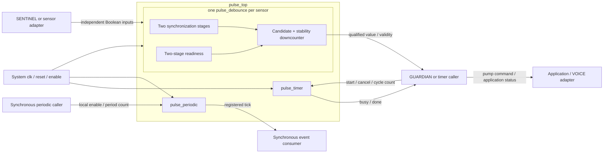

# PULSE architecture

Status: working software/RTL baseline, updated 2026-09-22 for [OSC-CONTRACT-1](OSCILLATOR_CONTRACT.md). External team interfaces and physical timing values remain **PROVISIONAL — pending agreement with integration team**.

Implementation language: Verilog HDL

## 1. Decisions and scope

This architecture applies the classified requirements and A-01 through A-12 in [requirements](PULSE_REQUIREMENTS.md). The user's continuation permits work beyond the original four-document review stop. Internal design review precedes RTL; it does not constitute SENTINEL/GUARDIAN/VOICE approval.

Use one system-clock domain with independent timing state for the one-shot, periodic generator, and each sensor. Direct cycle counts preserve exact start-to-expiry timing. Keep pump/fault policy outside the reusable block. The numerical baseline remains an illustrative 50 MHz clock, 1,000,000-cycle debounce, and a runtime 250,000,000-cycle application window. The user's oscillator-completion request adds recurring enable events under OSC-CONTRACT-1; it does not add water-tank behavior or establish an external consumer.

| Decision | Selected approach | Alternative / reason |
| --- | --- | --- |
| Module decomposition | `pulse_timer`, `pulse_debounce`, `pulse_periodic`, `pulse_top` | Each timing function owns its counter/state. A separate general counter adds wiring/control ownership without another consumer. |
| Timer datapath | Unsigned remaining-cycle count, loaded at accepted start | An upcounter plus captured target needs another wide stored value. A remaining count itself captures the requested interval. |
| Sensor qualification | One self-contained single-bit debouncer per channel | Sharing a timer would serialize qualification and could disturb protection. Separate instances are reusable and independently verifiable. |
| Sensor acquisition | Two-stage synchronizer and matching readiness pipeline inside each debouncer | Top-level-only synchronization would make the standalone debouncer's input contract different. Stage count is provisional pending hardware CDC analysis. |
| Periodic generator | Independent recurring registered clock-enable events under OSC-CONTRACT-1 | Completes the requested oscillator capability while preserving concurrent one-shot/debounce progress. A unit-bench event counter demonstrates use; the application disables it. |
| Periodic datapath | R-bit captured period and R-bit remaining count, plus active/output bits | Retain the original period across reloads; resampling live configuration would violate the contract. A square-wave output would require different timing semantics. |
| Configuration | Runtime one-shot and periodic counts with independent widths; elaboration-time debounce duration/channel count | No runtime debounce reconfiguration or bus protocol is required. |

## 2. Block diagram

All arrows carrying control/status are synchronous to `clk` except the provisional asynchronous sensor inputs. The periodic caller/consumer is demonstrated in the unit bench; no external team consumer is assigned by this diagram. The water-tank wrapper disables that branch. The diagram identifies logical ownership; it does not finalize another team's signals.

## 3. Module contracts

| Source | Parameters | Inputs | Outputs | Purpose |
| --- | --- | --- | --- | --- |
| `src/pulse_timer.v` | `TIMER_WIDTH = 32` | `clk`, `reset`, `enable`, `timer_start`, `timer_cancel`, unsigned `cfg_timer_cycles[W-1:0]` | `timer_busy`, `timer_done` | One independent configurable elapsed interval. |
| `src/pulse_debounce.v` | `DEBOUNCE_CYCLES = 1_000_000` | `clk`, `reset`, `enable`, scalar `sensor_in` | scalar `sensor_debounced`, `sensor_valid` | Synchronize and qualify one Boolean sensor. |
| `src/pulse_periodic.v` | `PERIOD_WIDTH = 32` | `clk`, `reset`, `enable`, `periodic_enable`, unsigned `cfg_period_cycles[R-1:0]` | `periodic_tick` | Capture one period and repeat registered events independently. |
| `src/pulse_top.v` | `TIMER_WIDTH = 32`, `SENSOR_CHANNELS = 2`, `DEBOUNCE_CYCLES = 1_000_000`, appended `PERIOD_WIDTH = 32` | Ports in [interface](PULSE_INTERFACE.md), including local periodic enable/configuration | Timer/sensor outputs plus `periodic_tick` | Wire one timer, one periodic generator, and S generated debouncers; no additional sequential latency. |

`CLOCK_FREQ_HZ` is integration/testbench metadata, not an unused production parameter. Every runtime configuration bus is unsigned. Parameter domains are W = TIMER_WIDTH >= 1, R = PERIOD_WIDTH >= 1, S >= 1, and 1 <= D <= 2,147,483,647 for the selected positive integer debounce parameter. Timer and periodic widths are independently configurable. The Verilog-2001 constant function `inclusive_count_width(D)` computes the bits needed for the inclusive range 0…D by starting at one bit and repeatedly shifting D right until it is at most one. This equals `max(1, ceil(log2(D + 1)))` for valid D without evaluating an overflowing `D + 1`: D = 1 needs one bit, D = 4 needs three, and the maximum valid D needs 31.

Elaboration-invalid parameters are rejected by simulation checks in the verification flow; they are not runtime fault states. Production logic uses `reg` for procedurally assigned storage, `wire` for input and child-driven connections, `always @(posedge clk)` with nonblocking register assignments, and explicitly sized constants. Debounce state values are two-bit `localparam` encodings held in `reg [1:0] state`. The application controller uses `always @(*)` for its combinational decisions. These Verilog-2001 constructs preserve the existing state encodings and edge behavior.

Simulation diagnostics belong in testbenches or `synthesis translate_off` sections. Procedural invariant checks use `if ((condition) !== 1'b1)` to detect both false and unknown conditions, then issue a `FAIL` diagnostic with `$display` and stop with `$stop`; the simulation runner reports failure. Parameter checks follow the same diagnostic path. No simulation-only diagnostic becomes synthesized hardware.

## 4. Timer datapath and control

An accepted start loads `remaining = max(1, cfg_timer_cycles)` and asserts busy. At each later enabled edge while busy, if old remaining > 1, decrement once. If old remaining = 1, clear remaining/busy and assert done for the following clock interval. `remaining` stays zero while idle. No second target register or free-running divider is needed.

Priority is reset, global disable, cancel, active count/expiry, idle start. Done clears by default each edge. A start on expiry is ignored because old busy is high; a start one edge later can be accepted. Zero and one both require one complete interval. Maximum W-bit input is loaded without adding one, avoiding overflow at the boundary.

Configuration changes after start cannot affect the loaded count. Cancel resets only the timer. There is no automatic reload, paused state, queued start, or DONE state requiring acknowledgement. The explicit transitions are in [state machines](PULSE_STATE_MACHINES.md).

## 5. Sensor datapath, control, and startup

Each debouncer contains two sensor synchronization registers, two readiness bits, a candidate bit, a remaining-cycle count, qualification state, and the accepted output/validity registers. Reset or sampled disable clears all of them. Synchronization runs on every enabled clock edge; no periodic sample tick gates it.

After reset/disable, suppose sensor input is stable before the first enabled edge `a0`:

| Edge | Synchronizer/readiness action after edge | Qualification action using old values |
| --- | --- | --- |
| `a0` | First stage captures input; readiness stage 1 becomes 1 | Wait; no fresh second-stage sample available. |
| `a1` | Second stage receives first captured value; readiness stage 2 becomes 1 | Still wait; old readiness stage 2 is 0. |
| `a2` | Pipeline continues | First fresh synchronized candidate is observed; load D. |
| `a(2+D)` | Pipeline continues | Accept if every observed sample since a2 matched; validity becomes 1. |

This timing also applies when the input equals the zero output reset value. A warmup state is necessary to prevent reset padding from satisfying the debounce interval.

During verification, an observed mismatch takes precedence over expiry, stores the new candidate, and reloads D. If the candidate matches and remaining = 1, accept it and mark stable. STABLE holds its qualified output until a different synchronized value starts a new full interval. Validity stays high during later changes; it means a previous qualified reading exists. During legal operation, reset/disable alone invalidate a qualified channel. Default recovery from the unused state encoding also clears that local channel, as defined in the state-machine specification.

The ideal simulation delay from a persistent input transition captured at edge `c0` to output qualification is D+2 cycles: stage 2 receives it at c1, the qualifier observes it at c2, and acceptance occurs at c(2+D). An arbitrary asynchronous transition adds the phase wait until c0, ideally less than one clock period. This is a digital-model schedule, not a physical metastability bound. A synchronous GUARDIAN sees a newly registered result on the next edge.

## 6. Data, timing, reset, and configuration flows

- Data: independent sensor bits pass through synchronization and qualification to value/valid outputs. No water-level decoding occurs within PULSE.
- Control: caller strobes timer start/cancel; PULSE returns busy/done. The separate periodic caller controls local enable. Neither set of function controls changes the other function or any sensor candidate/count.
- Timing: all state uses rising `clk`; timer, periodic, and per-sensor counts progress concurrently. Top-level wiring adds no registers or latency. Periodic tick is data/enable, never an internal clock.
- Reset: synchronous active-high reset reaches every submodule. Sampled disable has reset-like behavior for operational state. Initial values are not promised before a reset edge.
- Configuration: top-level elaboration parameters distribute independent timer/period widths and debounce duration. Timer configuration is sampled on accepted start; periodic configuration is captured at first jointly enabled edge after clearing and retained across reloads.
- Status: GUARDIAN consumes events synchronously; a slower/asynchronous VOICE adapter needs separately agreed retention/transport. No raw sensor bit drives a pump.

## 7. Resource and synthesis reasoning

The main storage is one W-bit timer downcounter plus busy/done; two R-bit periodic storage registers plus active/tick; and one debounce count of width ceil(log2(D+1)) per sensor plus synchronization/control/status bits. The periodic captured-period register retains the reload value; only remaining is decremented. This is an architectural estimate, not a measured Quartus utilization result. No multiplier, divider, RAM, PLL, vendor IP, derived clock, or inferred latch is needed. Constant parameter calculations occur at elaboration.

Production source lists contain five files: the four reusable-block modules above and `src/application/water_tank_controller.v`. The reusable synthesis top exposes periodic controls/configuration/tick so that the added function remains observable and retained. The application ties periodic enable low and configuration to zero, leaving tick unused, so synthesis may remove that inactive logic in the application top. Resource figures must identify which top was analyzed.

RTL analysis will inspect widths, multiple drivers, latch inference, reset behavior, and tool warnings. A later analysis project may select a representative supported FPGA solely to run synthesis checks; it will make no pin, board, device procurement, or physical implementation commitment.

## 8. Application boundary and verification handoff

The water-tank controller is an explicitly provisional GUARDIAN demonstration harness around `pulse_top`. Simulation-only tank/pump/noise models are Verilog HDL files under `tb/models`, distinct from synthesizable `src/application/water_tank_controller.v`. Its level encoding, response definition, and recovery policy retain the assumptions in [water-tank behavior](WATER_TANK_BEHAVIOR.md). The oscillator work explicitly ties `periodic_enable` low, drives zero periodic configuration, and leaves `periodic_tick` unused in that wrapper.

Verify each of the four reusable modules. Existing boundary checks retain one-cycle intervals, reduced-width exhaustive timer coverage, bounded maximum 32-bit timer cancellation, representative default-duration runs, startup qualification, mismatch at expiry, concurrent channels, and timer progress under noise. Periodic checks add first/repeated events, zero/minimum/odd/even/reduced-width periods, captured configuration across reloads, each clear source at expiry, restart, next-edge event consumption, bounded large counts, and independent concurrent operation. A checker self-test and developer smoke bench complement real-module independent tests; fixtures do not substitute for production DUT evidence.

The architecture and state-machine documents are internally reviewed before implementation. Tool execution and numerical synthesis/simulation results belong in the later verification records, not in this design description.

## 9. Periodic datapath and control: OSC-CONTRACT-1

`pulse_periodic` owns `active`, `captured_period[R-1:0]`, `remaining[R-1:0]`, and registered `periodic_tick`. A sampled reset, global disable, or local periodic disable clears all four. These conditions outrank a would-be expiry. On the first jointly enabled edge after clearing, load both R-bit registers with max(1, configuration), set active, and leave tick low. The capture edge is p0 and consumes no elapsed interval.

While active with old remaining greater than one, decrement remaining and clear tick. When old remaining equals one, reload from the retained captured period and assert tick. The captured period never changes while active. This gives the first event at pP and later events at p2P, p3P without an extra reload-only cycle. No count adds one to a maximum input, and no underflow is used.

For P > 1, the next decrement clears the event after one clock interval. For P = 1, every active edge expires/reloads one, so tick stays high after p1 and represents an event each cycle. A separate clocked consumer observes the first event at p(P+1); top wiring adds no further register. Consumers use tick as a synchronous enable.

Periodic local disable clears only periodic phase; re-enable recaptures and waits a fresh full period. Timer cancellation and sensor chatter cannot move its deadline. The [state-machine specification](PULSE_STATE_MACHINES.md) supplies the complete transition table, and [OSC-CONTRACT-1](OSCILLATOR_CONTRACT.md) supplies expected edge/frequency examples. All numerical simulation/synthesis claims remain in their evidence records.
