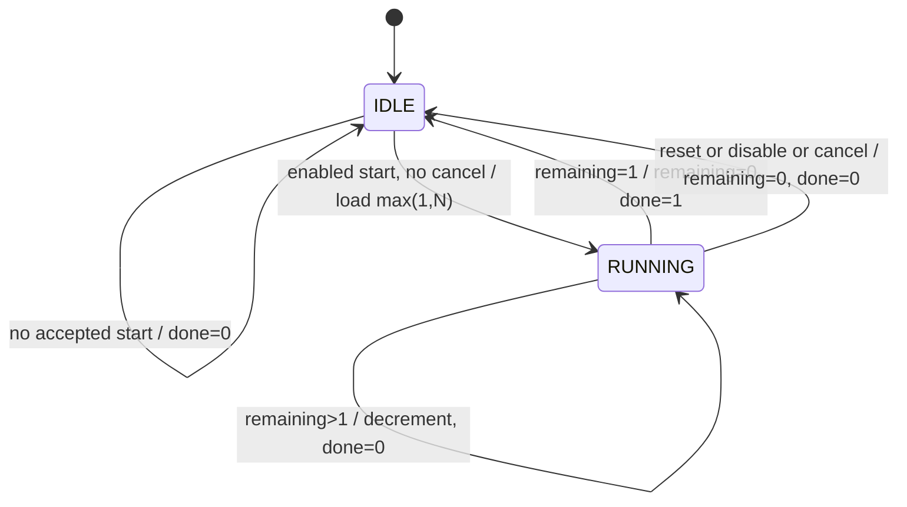
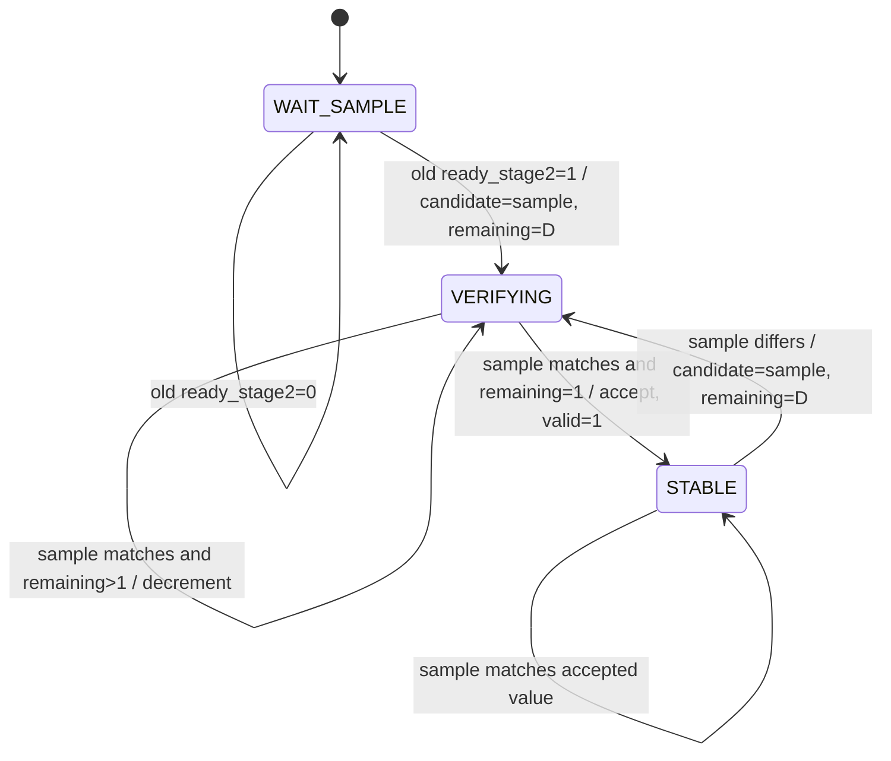

# PULSE state machines and edge behavior

Prepared: 2026-09-10. Status: **Baseline design for implementation; external clock, sensor, and application assumptions remain provisional.**

This document makes the cycle contracts in [PULSE_TIMING_SPEC.md](PULSE_TIMING_SPEC.md) and [PULSE_INTERFACE.md](PULSE_INTERFACE.md) concrete. The [architecture](PULSE_ARCHITECTURE.md) defines the module boundaries. No pump-control or dry-run decision state belongs to these machines. The optional periodic generator is omitted until F-11 has an identified consumer.

## 1. Reading the transitions

All machines advance on the rising edge of the same `clk`. Inputs, guards, and register values used in a transition are their values **before** that edge. Updates take effect **after** it. Sequential implementation must preserve this old-value convention, including between synchronizer stages and their consumer.

Reset is active-high and synchronous. Sampling `reset = 1` has highest priority. Sampling `enable = 0` has the same clearing effect but lower priority. Neither operation pauses an interval. Known outputs require a sampled reset; power-up values before it are not specified.

`W = TIMER_WIDTH >= 1`, `S = SENSOR_CHANNELS >= 1`, and `1 <= D = DEBOUNCE_CYCLES <= 2,147,483,647` for the selected positive integer debounce parameter. Store the debounce remaining count in `B = max(1, ceil(log2(D + 1)))` unsigned bits. The inclusive range is `0..D`; intermediate parameter arithmetic must not overflow while deriving B. Load and compare explicitly sized unsigned values. Reject invalid elaboration parameters in the verification flow before relying on simulation or synthesis results.

## 2. One-shot timer: `pulse_timer`

### 2.1 State and datapath

The one-bit `timer_busy` register is the state encoding. `timer_done` is a registered event, not a third state.

| State/register | Width | Meaning | Reset/disable/cancel value |
| --- | --- | --- | --- |
| `IDLE` | `timer_busy = 0` | An enabled, uncancelled start may be accepted on this edge. | Selected. |
| `RUNNING` | `timer_busy = 1` | An interval is in progress; starts are ignored. | Not selected. |
| `remaining` | W | Number of complete intervals still required after the preceding edge. | 0. |
| `timer_done` | 1 | Completion event, asserted only by uninterrupted expiry. | 0. |

At an accepted start, load `remaining = max(1, cfg_timer_cycles)`. This register is the captured configuration and working count; no separate configuration latch is needed. Neither a change on the configuration bus nor sensor activity changes the loaded operation.



The table below is authoritative when diagram conditions overlap.

### 2.2 Complete transition and update priorities

Evaluate rows from top to bottom. Take exactly one row per edge. `timer_done` defaults to zero on every ordinary edge and is overridden only by the expiry row.

| Priority | Old state / sampled condition | Next busy | Next remaining | Next done | Effect |
| --- | --- | --- | --- | --- | --- |
| 1 | Any; `reset = 1` | 0 | 0 | 0 | Abort and reset. |
| 2 | Any; `enable = 0` | 0 | 0 | 0 | Abort and disable. |
| 3 | Any; `timer_cancel = 1` | 0 | 0 | 0 | Abort/inhibit timer only. |
| 4 | RUNNING; `remaining = 1` | 0 | 0 | 1 | Report elapsed interval; ignore start. |
| 5 | RUNNING; `remaining > 1` | 1 | `remaining - 1` | 0 | Continue; ignore start and configuration changes. |
| 6 | IDLE; `timer_start = 1` | 1 | `max(1, cfg_timer_cycles)` | 0 | Capture and start a new interval. |
| 7 | IDLE; no start | 0 | 0 | 0 | Remain available. |

The RUNNING invariant is `1 <= remaining <= 2^W - 1`. There is no legal RUNNING/zero-count transition. This is an assertion obligation, not an additional fault-recovery feature. A subtract path is taken only from a legally reachable count greater than one.

There is no unused binary state encoding because busy is one bit. X/Z state or controls are invalid simulation conditions; no analog fault-tolerance behavior is claimed. IDLE always has zero remaining after a legal transition. Done and busy can never both be high after a legal edge.

### 2.3 Exact timer boundaries

For an accepted start at `e0`, define `N = max(1, captured_configuration)`. Immediately after `e0`, busy is one, remaining is N, and done is zero. At each following uninterrupted edge `ek` for `1 <= k < N`, remaining becomes `N-k`. Edge `eN` consumes the final full interval and produces busy zero, remaining zero, done one. Edge `e(N+1)` clears done and may accept a new start.

| Edge, N = 3 | Old state/count | Transition | Busy/count/done after edge |
| --- | --- | --- | --- |
| `e0` | IDLE/0 | Accept configuration 3. | `1 / 3 / 0` |
| `e1` | RUNNING/3 | Decrement. | `1 / 2 / 0` |
| `e2` | RUNNING/2 | Decrement. | `1 / 1 / 0` |
| `e3` | RUNNING/1 | Expire; a simultaneous start is ignored. | `0 / 0 / 1` |
| `e4` | IDLE/0 | Clear done; accept a presented start if eligible. | `0 / 0 / 0`, or `1 / new_N / 0` |

Boundary consequences:

- Configuration 0 and configuration 1 both load one and complete at `e1`; neither completes at the start edge.
- Configuration `2^W-1` loads that value without incrementing it. Completion is exactly that many intervals later; no rollover is used.
- Cancellation, disable, or reset sampled on `eN` suppresses done. The same controls sampled on the following edge clear the event normally, but cannot undo its preceding high interval or a consumer's observation of it.
- A start on `eN` is ignored because the old state is RUNNING. A start on `e(N+1)` can be accepted, while a downstream register captures the preceding completion event on that same edge.
- A continuously high start is a caller protocol error. It will be accepted again at a later eligible IDLE edge because this design has no start edge detector or queue.

## 3. Sensor synchronizer and startup readiness: inside each `pulse_debounce`

Each Boolean channel owns two input synchronizer registers and a two-stage readiness pipeline. No state or counter is shared between channels. The readiness bits describe pipeline initialization; they do not detect metastability or validate sensor meaning.

On reset/disable, clear `sync_stage1`, `sync_stage2`, `ready_stage1`, and `ready_stage2` to zero. On every ordinary enabled edge, update them using old values:

```text
sync_stage1(next)  = sensor_in
sync_stage2(next)  = sync_stage1(old)
ready_stage1(next) = 1
ready_stage2(next) = ready_stage1(old)
```

Only `sync_stage2(old)` reaches the qualification machine, and only when `ready_stage2(old) = 1`. In particular, logic must not consume the newly assigned second-stage value or use newly asserted readiness on the same edge. No combinational path from the asynchronous pin enters a counter or qualification-state decision.

Let `a0` be the first enabled edge after a sampled reset or disable. Suppose the physical input is stable at C and is captured normally.

| Edge | Synchronizer/readiness after edge | Qualification decision from old registers |
| --- | --- | --- |
| Reset/disable edge | Both data stages 0; readiness `00`. | WAIT_SAMPLE; output/valid/count cleared. |
| `a0` | First data stage C, second stage 0; readiness `(stage1, stage2) = (1,0)`. | Old stage2 is not ready; remain WAIT_SAMPLE. |
| `a1` | Both data stages C; readiness `(1,1)`. | Old ready stage2 is still zero; remain WAIT_SAMPLE. |
| `a2` | Pipeline continues sampling. | First fresh observation C: load candidate C and count D. |
| `a(2+D)` | Pipeline continues sampling. | Accept C if every intervening observation including this one matched. |
| `a(3+D)` | Pipeline continues sampling. | A downstream register can first consume the newly valid qualified value. |

Startup qualification thus begins two full clock intervals after the first capture edge and completes D intervals after that observation. Even a zero input must follow this sequence; reset-filled zeros cannot make a channel valid early. Re-enabling repeats the whole sequence. The timer may accept a start at `a0`; it does not wait for sensor readiness.

During normal operation, an input captured by stage1 on edge `c0` can reach stage2 after `c1` and is first observed by qualification on `c2`. These are digital simulation edge relationships. They do not specify a bound from an arbitrary physical transition in the presence of metastability. The D-cycle debounce interval is additional to synchronization and any consumer latency.

## 4. Sensor qualification: one machine per `pulse_debounce`

### 4.1 Registers, encoding, and outputs

| Register/state | Width or encoding | Meaning / reset value |
| --- | --- | --- |
| `WAIT_SAMPLE` | State `2'b00` | Waiting for the first fresh synchronized observation; reset state. |
| `VERIFYING` | State `2'b01` | Candidate is awaiting D full unchanged intervals. |
| `STABLE` | State `2'b10` | Candidate has been accepted and currently observed samples agree. |
| Unused state | State `2'b11` | Default recovery described in section 4.4. |
| `candidate` | 1 bit | Value currently being qualified or last accepted; reset 0. |
| `remaining` | B unsigned bits | Full qualification intervals still required; reset 0. |
| `sensor_debounced` | 1 bit | Last accepted value; reset 0. |
| `sensor_valid` | 1 bit | At least one value qualified since reset/disable; reset 0. |

Keep `sensor_valid` separate from the state. VERIFYING can mean either startup with valid zero or a later possible change with valid one. A transition into VERIFYING after startup must preserve valid and the last accepted value.



Reset or disable takes every state to WAIT_SAMPLE and clears all channel registers. For diagram labels, `sample` means the old second synchronizer stage.

### 4.2 Qualification transitions and update priorities

The reset/disable clear precedes every table row. An unused state encoding invokes the default clear. The pipeline continues its ordinary sampling on valid enabled transitions. All registers not listed as updated retain their values.

| Old state / guard | Next state | Candidate/count updates | Output/valid updates |
| --- | --- | --- | --- |
| WAIT_SAMPLE; old ready stage2 = 0 | WAIT_SAMPLE | Candidate 0; remaining 0. | Output 0; valid 0. |
| WAIT_SAMPLE; old ready stage2 = 1 | VERIFYING | Candidate = sample; remaining = D. | Hold output 0 and valid 0. |
| VERIFYING; sample differs from candidate | VERIFYING | Candidate = sample; remaining = D. | Hold last output and valid. |
| VERIFYING; sample matches, remaining > 1 | VERIFYING | Hold candidate; remaining = remaining - 1. | Hold last output and valid. |
| VERIFYING; sample matches, remaining = 1 | STABLE | Hold candidate; remaining = 0. | Output = candidate; valid = 1. |
| STABLE; sample differs from candidate | VERIFYING | Candidate = sample; remaining = D. | Hold last output and valid. |
| STABLE; sample matches candidate | STABLE | Hold candidate; remaining = 0. | Hold output and valid = 1. |

In VERIFYING, compare the current sample to candidate **before** testing expiry. A mismatch with old remaining one reloads D and never accepts the old candidate on that edge. Do not decrement a freshly loaded count on its load edge.

Every mismatch in VERIFYING restarts D, including a return to the already accepted value. This uniform rule may qualify that accepted value again internally; it does not change the exposed output or clear its validity. STABLE is entered only after the full interval has completed.

`timer_start`, `timer_cancel`, timer configuration, timer busy, and timer done are absent from all qualification guards. A timer abort must leave qualified readings, pending sensor candidates, their counters, and the synchronizer pipeline unaffected.

### 4.3 Qualification boundaries and example traces

Let `d0` be the first observation of a new candidate. After `d0`, remaining is D. If every subsequent observation matches, remaining is `D-k` after each `dk` for `1 <= k < D`, and acceptance occurs after `dD`. The D complete intervals span **D+1 observations** including the first and last.

| Edge, D = 3 | Sample and old candidate/count | Action | Result after edge |
| --- | --- | --- | --- |
| `d0` | First candidate C. | Load. | VERIFYING; candidate C; remaining 3. |
| `d1` | C / C / 3 | Match and decrement. | VERIFYING; remaining 2. |
| `d2` | C / C / 2 | Match and decrement. | VERIFYING; remaining 1. |
| `d3` | C / C / 1 | Match at expiry. | STABLE; remaining 0; output C; valid 1. |

For D = 1, load at `d0` and accept only on a matching `d1`. A different sample at `d1` replaces the candidate and reloads one; it requires a matching `d2` to qualify. A zero debounce setting is invalid and does not select bypass behavior.

Expiration-edge mismatch example, initially accepted output A with validity one and D = 3:

| Observation edge | Sample | Action | Accepted output/valid after edge |
| --- | --- | --- | --- |
| `b0` | B, different from A | Start B qualification; load 3. | A / 1. |
| `b1` | B | Remaining becomes 2. | A / 1. |
| `b2` | B | Remaining becomes 1. | A / 1. |
| `b3` | A | Mismatch outranks expiry; candidate A, reload 3. | A / 1; B was never accepted. |
| `b4` | A | Remaining becomes 2. | A / 1. |
| `b5` | A | Remaining becomes 1. | A / 1. |
| `b6` | A | Accept A again internally; enter STABLE. | A / 1. |

A change on a different sensor channel neither restarts this sequence nor changes its output. All valid bits high means every channel has qualified independently, with no atomic multi-bit snapshot guarantee.

### 4.4 Reset, unused states, and illegal values

Reset and disable clear the state, candidate, count, qualified output, validity, and both data/readiness stages on the sampled edge. A default branch for unused state `2'b11` performs that same local channel clear. Other channels and the timer continue independently; a later enabled edge begins fresh acquisition for the cleared channel.

After normal initialization the following invariants must hold:

- VERIFYING has `1 <= remaining <= D`; STABLE and WAIT_SAMPLE have remaining zero.
- VERIFYING and STABLE have readiness stage2 high. Once initialized, readiness remains high until reset, disable, or the unused-state recovery.
- STABLE has valid one and `candidate = sensor_debounced`.
- Valid cannot fall during legal enabled operation. Before initial qualification, valid and output remain zero.

Violations of these invariants are simulation failures. The implementation need not add counter-corruption detectors, a fault output, or new externally visible recovery semantics. X/Z samples, configuration, control, or state are not additional valid inputs; assertions/testbench checks should report them at their appropriate observation or acceptance points. The default state branch is not evidence of recovery from analog metastability or all hardware faults.

## 5. Composition and implementation review

`pulse_top` connects one timer and S independent debounce channels. It needs no additional functional state machine. Every child samples the common clock/reset/enable; only the timer receives start/cancel/configuration. Output port registers are owned by their respective child, with direct top-level connections and no added output stage.

A qualification completion and timer expiry may occur after the same edge. Both outputs must be preserved. GUARDIAN observes the registered results on a later edge and owns response-versus-timeout priority. A cancel already present before an expiry edge suppresses the timer event; a cancel derived later from a newly changed sensor output cannot suppress it retroactively.

Before accepting RTL, review the following obligations against the eventual simulations:

| Obligation | Required evidence |
| --- | --- |
| Accepted timer start consumes zero elapsed intervals. | Zero, one, representative, and maximum-count edge checks. |
| Old busy controls acceptance even at expiry. | Starts during running, exactly at expiry, and immediately afterward. |
| Abort controls outrank completion. | Reset/disable/cancel on the final-count edge; cancellation does not disturb sensors. |
| The configuration is captured once. | Change configuration during a running interval and verify unchanged deadline. |
| Qualification observes only old ready stage2 and old sync stage2. | Startup and re-enable checks for both zero and one inputs, including the a0/a1/a2 sequence. |
| A candidate gets D full intervals and mismatch wins at expiry. | D = 1 and representative D; alternating noise and final-edge mismatch. |
| Validity is independent of later candidate activity. | Startup invalidity, stable acceptance, and valid output held through rejected changes. |
| Channels and timer advance independently. | Concurrent timer, chatter on one channel, and qualification on another. |
| No inferred combinational state or duplicate register owners. | RTL review and Quartus analysis when the implementation exists. |

The tables are design and review evidence. Passing functional simulation, synthesis results, and application behavior must be reported separately after they are run.
