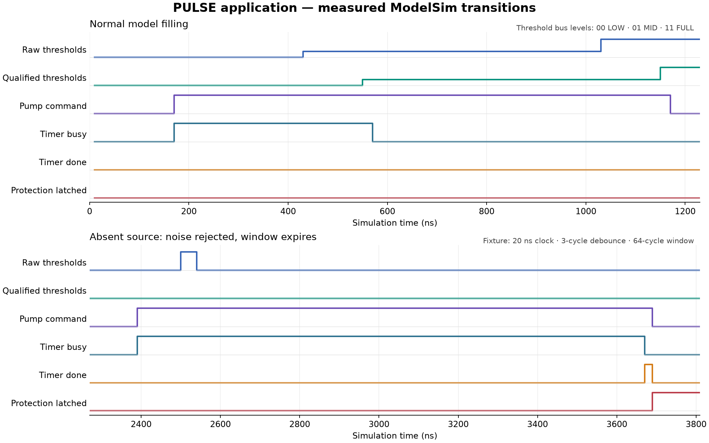

# Measured application waveform observations

Status: **Observed from an executed ModelSim-Altera 10.1d application simulation.** The application policy and accelerated physical-process model remain the provisional fixture in [WATER_TANK_BEHAVIOR.md](WATER_TANK_BEHAVIOR.md).

## 1. Source and extraction

The source is [water_tank_system.vcd](../build/modelsim/run-20260910-065458-111/water_tank_system.vcd), generated by the complete regression in `build/modelsim/run-20260910-065458-111`. The matching [application transcript](../build/modelsim/run-20260910-065458-111/water_tank_system_tb.log) reports `PASS water_tank_system_tb` with 715 checks and 684 cycles. The VCD records `test_passed = 1` at 13,671 ns. Generated simulator files are local build artifacts and are not tracked in Git.

| Source property | Recorded value |
| --- | --- |
| VCD size | 82,918 bytes. |
| VCD timescale | 1 ps; tables and figure convert to ns. |
| VCD final timestamp | 13,671 ns. |
| VCD SHA-256 | `ff5653cf1fed5d1199ab125657807d43954bc90d31b1f64c9f83e8b9980b71cd` |
| Clock fixture | 20 ns period; rising edges at 10, 30, 50 ns, etc. |
| Debounce fixture | D = 3 full intervals = 60 ns after the first synchronized candidate observation. |
| Protection fixture | N = 64 intervals = 1,280 ns after accepted start. |

The Verilog conversion run was extracted and compared with the tracked baseline CSV: all 127 settled snapshots are identical, including timestamps, state encodings, and control/status values. The CSV and its plot therefore remain valid without modification; the VCD metadata above identifies the new recording. This is comparison of recorded application behavior, not a formal equivalence proof.

The tracked [event CSV](waveforms/application_events.csv) contains 127 significant transition snapshots. Each row retains the final recorded signal values at its timestamp after all VCD changes at that timestamp have been read. It includes raw/qualified threshold codes, validity, controls, timer status, pump/flow, tank level, and controller state. Clock toggles and counter-only changes are omitted. Consequently, elapsed time between rows does not mean the clock stopped, and intermediate zero-time simulation updates are not shown.

The [extraction helper](waveforms/extract_application_waveforms.py) reads the actual VCD with the Python standard library and reconstructs scalarized buses from their recorded bit indices. Matplotlib, already present during this review, generated the standalone plot below from the same snapshots. Neither Python nor Matplotlib is required by the RTL regression.



Threshold-bus trace height encodes 00 = LOW, 01 = MID, and 11 = FULL. Other lanes are Boolean. The figure shows two selected regions; the CSV and following tables cover the remaining cases.

## 2. Startup and normal filling: A / E-startup

| Time (ns) | Recorded observation | Meaning |
| --- | --- | --- |
| 0 | Pump, timer outputs, and qualified sensor outputs initially contain X. | No known power-up state is promised before a sampled reset. |
| 10 | Pump/fault/timer outputs clear; qualified code and validity become 00. | First rising edge samples asserted synchronous reset. |
| 40 | Reset falls. | Next rising edge, 50 ns, is the first enabled sensor capture. |
| 50 / 70 | Channel readiness becomes `(stage1, stage2) = (1,0)` / `(1,1)`. | Internal VCD inspection confirms pipeline initialization. |
| 90 / 110 / 130 / 150 | Channel-0 remaining count is 3 / 2 / 1 / 0. | Fresh LOW starts qualification at 90 ns and completes three full intervals later. |
| 150 | Validity becomes 11; qualified code stays 00; pump remains off. | Zero startup still requires full qualification. |
| 170 | Pump, modeled flow, and timer busy assert together. | Controller observes valid LOW and starts the pump/window on one edge. |
| 430 | Model level becomes 30 and raw code becomes 01. | The model crosses its lower threshold after this edge. |
| 550 | Qualified code becomes 01; pump remains on. | MID response is accepted. |
| 570 | Timer busy clears, controller enters FILLING, pump remains on. | Controller consumes MID one edge later and cancels monitoring without expiry. |
| 1,030 | Model level becomes 90; raw code becomes 11. | Model reaches the FULL threshold. |
| 1,150 | Qualified code becomes 11. | FULL qualification completes. |
| 1,170 | Pump/flow fall; controller returns to IDLE. | Controller consumes FULL one edge later. Model level is 100. |

For the model-generated MID transition, the VCD shows stage1 capturing one at 450 ns, stage2 at 470 ns, candidate/count loading at 490 ns, and acceptance at 550 ns. Thus first capture to acceptance is `550 - 450 = 100 ns = (D+2) clocks`. The raw model signal changes after the 430 ns sampling edge, so raw transition to acceptance is 120 ns. This additional capture wait is explicit in the recorded digital schedule.

No `timer_done`, dry-run, or protection pulse occurs during this normal fill. Later drainage changes the qualified code from FULL to MID at 2,150 ns while the pump remains off, showing the fixture's IDLE hysteresis.

## 3. Noise rejection and exact timeout: B / C

| Case | Raw disturbance / start | Recorded result |
| --- | --- | --- |
| B1, false LOW on FULL tank | Noise mask 11 drives raw 00 from 1,260 to 1,300 ns: 40 ns, two sampled clocks. | Qualified code remains 11; pump stays off; no fault. |
| B2, false response during monitoring | Pump/window start at 2,390 ns with source unavailable and tank level zero. Noise drives raw 11 from 2,500 to 2,540 ns. | Qualified code remains 00; pump and timer remain active; monitoring is not cancelled or restarted. |
| C, exact expiry | Timer start 2,390 ns; done rises at 3,670 ns. | `3,670 - 2,390 = 1,280 ns = 64 clocks`. Busy falls, but pump is still on at the done edge. |
| C, controller observation | Done falls and protection/dry-run rise at 3,690 ns; pump falls. | `3,690 - 2,390 = 1,300 ns = 65 clocks`. Done is high for exactly 20 ns. |

Modeled flow is zero and model tank level remains zero throughout the first absent-source interval. Noise does not change the deadline. These observations establish the simulated elapsed-window behavior and its one-clock controller observation delay; they do not establish a physical dry-run threshold.

## 4. Latched protection and recovery: D

Source availability is restored at 3,700 ns. Pump and flow remain zero and protection remains high until the explicit clear. `fault_clear` rises at 5,080 ns; protection clears and the controller enters IDLE at 5,090 ns. Pump remains off on that edge. The next edge at 5,110 ns starts a fresh pump command, flow, and monitoring window from the still-qualified LOW reading.

Recovery filling qualifies MID at 5,470 ns, cancels the timer at 5,490 ns, qualifies FULL at 6,070 ns, and stops at 6,090 ns. No fault appears during recovery filling. Restored source alone does not retry; the clear is consumed before the subsequent start edge.

## 5. Reset during operation: E

| Previous activity | Reset assertion / sampled effect (ns) | Recorded result |
| --- | --- | --- |
| WAIT_RESPONSE, pump/window started at 6,270 | 6,440 / 6,450 | Pump, timer busy, qualified output, and validity clear on the sampling edge; no done pulse. |
| PROTECTED, fault asserted at 7,890 | 7,900 / 7,910 | Fault/protection clear and controller returns to IDLE. |
| FILLING, MID accepted at 8,170 and consumed at 8,190 | 8,200 / 8,210 | Pump clears while timer was already idle; sensor validity and qualified output reset. |

After the first of these resets releases at 6,460 ns, fresh validity returns at 6,570 ns and a new LOW start occurs at 6,590 ns. After the FILLING reset releases at 8,220 ns, MID requalifies at 8,330 ns and the controller stays IDLE with pump off. No stale valid reading bypasses acquisition.

## 6. Simultaneous response and expiry: F

These cases use directly driven threshold predicates, as identified by `direct_sensors = 1` in the CSV. They isolate digital decision timing rather than use the model's tank level as evidence of water movement.

| Response | Pump/window start | Raw response driven / first stage captures | Qualified response and done rise together | Next controller edge |
| --- | --- | --- | --- | --- |
| FULL, code 11 | 8,530 ns | 9,700 / 9,710 ns | 9,810 ns: qualified 11, done 1, busy 0, pump still 1. | 9,830 ns: pump 0, IDLE, done 0, no fault. |
| MID, code 01 | 10,010 ns | 11,180 / 11,190 ns | 11,290 ns: qualified 01, done 1, busy 0, pump still 1. | 11,310 ns: pump remains 1, FILLING, done 0, no fault. |

Both done edges are exactly 1,280 ns after their starts. Both first-capture-to-qualification intervals are 100 ns. FULL stops filling and MID preserves it when the controller observes the response together with done. The recorded done pulse is present in both cases; the application response priority avoids latching protection without retroactively suppressing the registered event.

## 7. Contradictory readings and disable: G

Contradictory code 10 qualifies during FILLING at 11,510 ns and the pump stops at 11,530 ns without a dry-run latch. After reset, contradictory code qualifies at 11,670 ns and inhibits a new start. LOW requalifies at 11,850 ns and starts monitoring at 11,870 ns; another contradictory code qualifies at 11,990 ns and cancels/stops that live interval at 12,010 ns.

Disable is asserted at 12,160 ns and sampled at 12,170 ns, clearing pump, timer, output, and validity. Enable returns at 12,220 ns; fresh validity arrives at 12,330 ns and LOW starts a new interval at 12,350 ns. Done rises at 13,630 ns and protection follows at 13,650 ns, again showing 64-clock expiry and 65-clock pump stop. A final disable sampled at 13,670 ns clears the latched protection. The pass marker follows at 13,671 ns after testbench checks.

## 8. Reproduction and limits

From the repository root, use Python with the recorded application VCD path:

```text
python docs/waveforms/extract_application_waveforms.py build/modelsim/run-20260910-065458-111/water_tank_system.vcd
```

The helper rewrites the CSV and, when Matplotlib is available, the PNG in `docs/waveforms`. It reports the source hash, timescale, end time, transition-row count, and selected transitions. A new simulation run has a different build-directory name; pass its VCD explicitly and review timestamps before replacing these recorded observations.

This inspection used the actual VCD, plus the matching testbench transcript and source to identify cases. The WLF was generated by the run but was not separately inspected in the ModelSim GUI. The PNG is a plot of recorded data, not a GUI screenshot. The exported CSV preserves selected settled values and is not a complete replacement for the VCD's internal signals or delta-cycle history.

The application uses a 60 ns debounce and 1.28 us window to accelerate scenarios. These plots do not demonstrate the proposed 20 ms/5 s application settings. Default-duration debounce and timer parameter boundaries have separate unit evidence. No analog metastability, electrical behavior, hydraulic calibration, real sensor coherence, or physical hardware operation is inferred from these digital traces.
